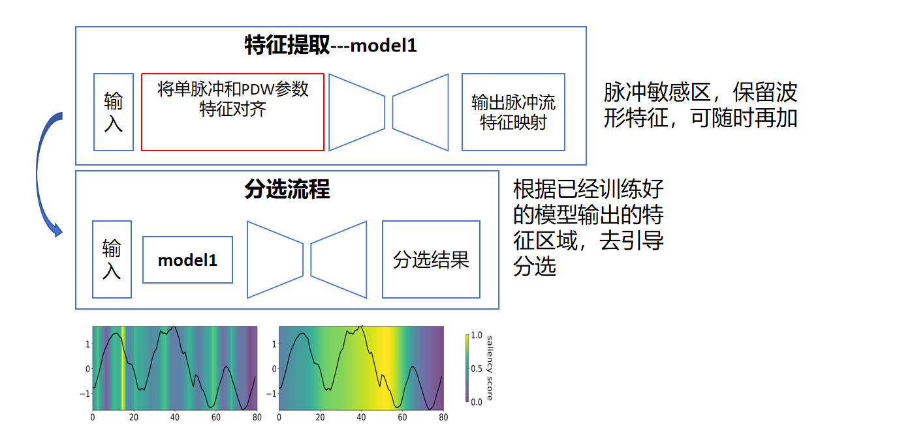

**周报**

这周主要就是在看论文。

英文实验部分

1. 基础场景LFM波形，抖动PRI。

2. 混合波形,抖动PRI。
3. LFM波形，抖动PRI，两个辐射源脉宽变换。
4. 五个辐射源随机选择任意一种PRI类别。

这里面也就第四个算是之前做不出来的吧，然后改了之后能做出来。后面我感觉我模型就是还需改一下，再加新的实验的东西。

然后关于脉冲的载频信息，我仿真是默认是基带信号，然后线性调频到200kHz。目前我有点不理解就是之前说的那种特征对齐。

我的想法就是说

训练一个系统，两个可以单独存在有用。

这样就延伸出两个问题

1.特征对齐训练，如何正确的训练出识别不同波形，不同脉宽，不同载频的信号，并给出足够区分度的特征映射。

2.就是我目前的分选网络。