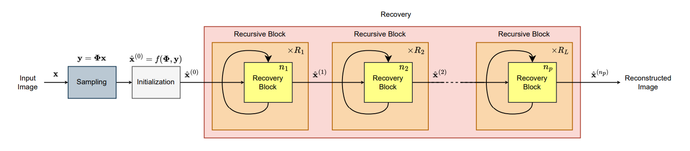
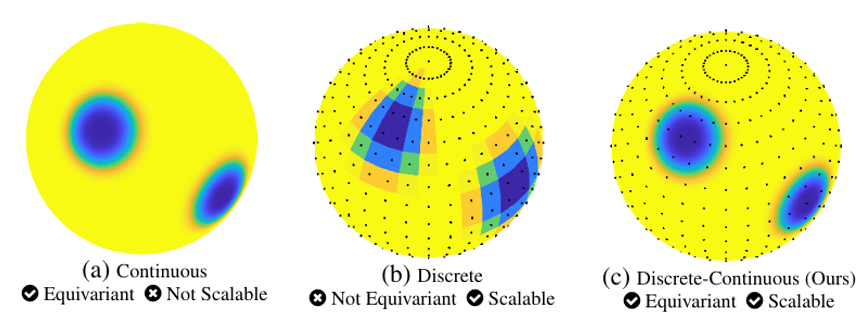
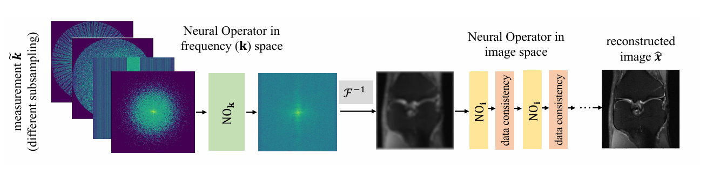
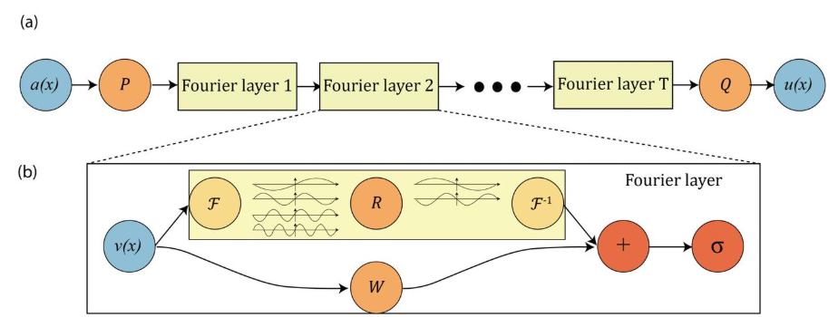
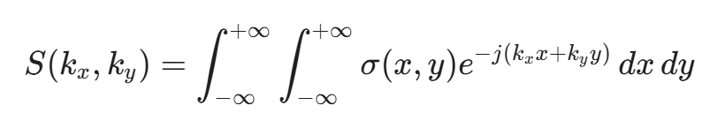
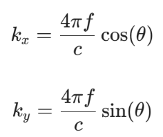
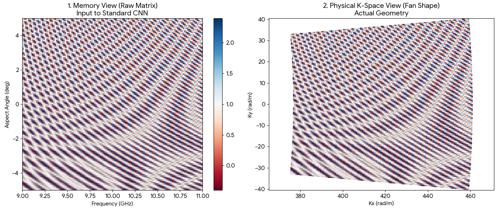

### Recursions Are All You Need: Towards Efficient Deep Unfolding Networks（CVPR）

**code：** https://github.com/RawwadAlhejaili/Recursions-Are-All-You-Need.

展开网络

递归循环展开网络

**创新点：**

主要就是设计了一个递归循环的机制，能让展开网络的参数大幅下降，而且能够保证其性能基本不变。

其计算流程如下：

1. **获取递归状态：**

   在每一次递归开始时，获取当前的特征向量 $z$，并读取两个关键的状态参数：当前是第几次迭代 ($R_{cur}$) 以及 总共要迭代多少次 ($R_{tot}$) 。

2. **通过MLP生成动态权重：**

   将上述状态参数（$z, R_{cur}, R_{tot}$）作为一个整体向量，输入到一个由两层线性层（Linear Layers）和 ReLU 激活函数组成的小型多层感知机（MLP）中，计算出一组特定于当前递归进度的 调制系数 ($\sigma_c$) 。

3. **执行特征调制：**

   将计算出的调制系数 $\sigma_c$ 与**主干网络模块输出**的特征图进行逐元素乘法 (Element-wise Multiplication)，以此增强或抑制特定的特征通道。

4. **递归循环：**

   将调制后的特征传回模块入口，作为下一次递归计算的基础，直到达到设定的总迭代次数 $R_{tot}$ 。

### SCALABLE AND EQUIVARIANT SPHERICAL CNNS BY DISCRETE-CONTINUOUS (DISCO) CONVOLUTIONS

code:https://github.com/neuraloperator/mri

这个文章主要是提出了一个兼具计算可扩展性和旋转等变性的**离散 - 连续**（DISCO）球面卷积神经网络框架，旨在解决现有球面 CNN 在**高分辨率数据处理**中的核心痛点，以及弥补CNN所不具备的**旋转可变性**。

$$(f * \psi)(R) \approx \sum_{i} f[\omega_i] \psi(R^{-1}\omega_i) q(\omega_i)$$

1. **$f[\omega_i]$ (离散输入)**：输入信号（如球面图像）在有限的采样点 $\omega_i$ 上的离散值。

2. **$q(\omega_i)$ (积分权重)**：根据采样定理确定的求积权重（Quadrature weights），用于保证积分的精度。

3. **$\psi(R^{-1}\omega_i)$ (连续核)**：这是关键。滤波器（卷积核）$\psi$ 被定义为一个**连续函数**。计算时，先将采样坐标 $\omega_i$ 进行**连续旋转** ($R^{-1}$)，然后将旋转后的坐标代入连续的滤波器函数中求值 。

**计算过程：**

1. 拿到离散的输入图像。

2. 根据卷积核的形状，在连续空间中计算出它在特定旋转角度下“覆盖”了哪些输入像素，以及对应的权重是多少（**连续核求值**）。

3. 把这些权重存成一个**稀疏矩阵**。

4. 利用**矩阵乘法**一次性算出卷积结果。

### A Unified Model for Compressed Sensing MRI Across Undersampling Patterns（CVPR）

code:https://github.com/neuraloperator/mri

模型流程：
将不同的稀疏处理下的K空间域的MRI数据，经过一个NOk处理，得到一个统一的频域数据，然后再逆变换，再通过展开网络进行求解。

**创新点：**

1. 基于神经算子，提出了一种与输入分辨率无关的 MRI 重建框架。
2. 同样的采用离散-连续卷积，而DISCO 的卷积核是定义在**连续函数空间**中的，使得其可以保证覆盖范围不变。

这个就是和稀疏成像相关度比较高的，里面牵扯到一个傅里叶神经算子的概念。

**傅里叶神经算子（FNO）：**

不同于常规网络学习在**学习**有限维欧几里得空间之间的**映射**，傅里叶神经算子学习的是**无限维函数空间**之间的映射，也即学习二者的物理映射而非像素点特征。具体实现如下：

code:https://github.com/neuraloperator/neuraloperator

输入经过两个分支，一个是通过傅里叶变换，然后再给个门限进行滤波保存低频信号，最后再反傅里叶变换。另外一个分支是训练一个可学习参数W，然后二者相加，最后再通过一个非线性激活函数。

**我目前联想到成像工作的：**

其中：

该数据其实是扇形，尤其是再**大角度下**更明显

而扇形的数据与球面数据有相同之处，扇形的数据可以类比为球的一个环。

同样的，对于卫星而言，其大部分时间运动所成出的像都是**旋转像**，不同于CNN，离散 - 连续卷积具备真正的旋转可变性。

所以我觉得**离散 - 连续卷积**应该是一个很好的方向去做到网络里面。同样的上面的那个框架，也是一种思路，可以用低分辨率图像，去训练，然后在推理阶段输入更高的维度的数据，去生成高分辨率图像。

