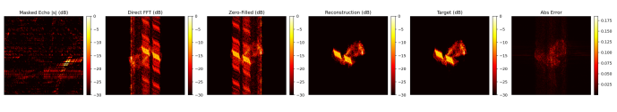
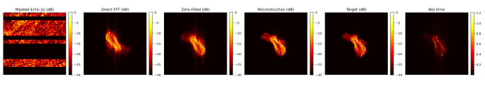
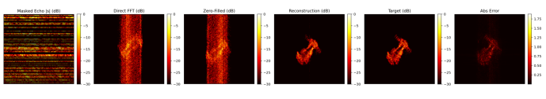
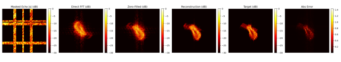
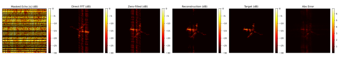

**周报**

1.根据论文实现复数Transformer的模型构建。

这个模型我试了一下，这个在通信方面挺强了，后面我打算拿这个做雷达IQ信号的特征提取。

2.一直在跑成像的代码，上周五跑出来的效果还行，但是后面整理把训练好的模型删了。

**百分之50**

**百分之30**

**0样本**

3.后续尝试用一下通过**复数Transformer＋PDW参数**做脉冲的特征提取，然后做特征融合。后续再接时序处理，准备一个模型去做参数估计＋分选。目前该通了代码。还没来得及训练。