周报

**1.脉内内容**

雷达复信号为：

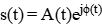 

其中，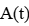为幅度包络，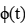为相位。

对应的***\*瞬时频率\****为：

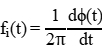 

其所有的脉内调制，都会从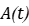，以及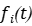去表现出来。

而绝大部分的都是从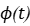这个其设置，例如LFM，其 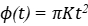。

 

对这些脉内调制而言，其在实部、虚部与时间三维空间中具有明显可分的轨迹特征，而对应的表明其调制类别和关键参数均包含在复数信号的时序演化规律之中。

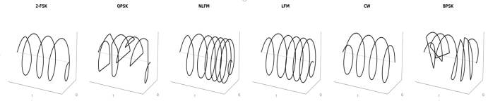 

因此，模型设计的核心问题就变成：如何从复值时序中有效提取这种演化规律。这个包括短距离与长距离的特征构建。

目前这个复数transformer是不改了，优化了模型的实现。
目前跑了一些对比试验，复数CNN，实数Transformer，和实数CNN
目前的结果是
我的复数Transformer > 实数CNN > 复数CNN > 实数Transformer。
复数Transformer > 实数CNN 大概3个点左右。
复数Transformer > 复数CNN > 实数Transformer。这个基本上要大于十几个点。
计算复杂度：
实数CNN > 复数CNN > 复数Transformer > 实数Transformer。前面的模型复杂度为复数Transformer的两倍。

**2.脉间内容**

在标准 SSM 中，历史信息通过状态转移矩阵 A 进行递归传播，其本质上是一种逐层压缩的状态汇聚机制。该机制对于局部连续、短程相关的序列建模较为有效，但在脉冲流场景下存在明显局限。原因在于，同一辐射源产生的脉冲在时间轴上往往并非连续出现，而是受到丢脉冲、交织干扰以及多源混叠等因素影响，呈现出跨脉冲间隔大、分布稀疏、相关性跨 chunk 存在的特点。此时，若仅依赖 SSM 内部的递推压缩过程，早期同源脉冲所携带的判别信息在长距离传播过程中可能被不断衰减，导致模型难以稳定捕获远距离的同源关联。

基于此，本文在 Mamba-2 的顺序状态传播之外，引入了跨 chunk 记忆机制。具体而言，模型首先对每个 chunk 提取摘要表示，并将历史 chunk 的关键信息存入记忆库；当前 chunk 在处理前，通过相似性检索从记忆库中读取最相关的历史上下文，再以门控方式注入当前表示中。这样一来，模型不再仅依赖单一路径的递归压缩状态传递，而是构建了一条显式的跨块信息回路，从而增强了对远距离同辐射源脉冲关系的建模能力。

实验设置

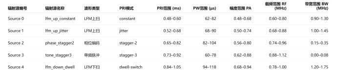 

对比实验，其中full，block均为跨chunk，但是二者的设置方式不同，full 存的是每个 chunk 的细粒度记忆，而block 存的是多个 chunk 的聚合记忆。

短时间上

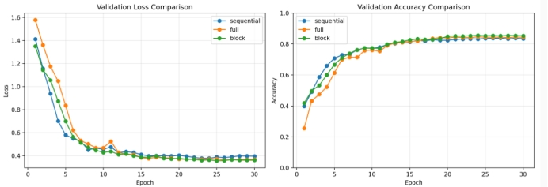 

可以看到跨chunk确实可以提升整体的性能。

与PW/PA/RF融合，性能提升4个点，但是多个 chunk的最终性能区别不大

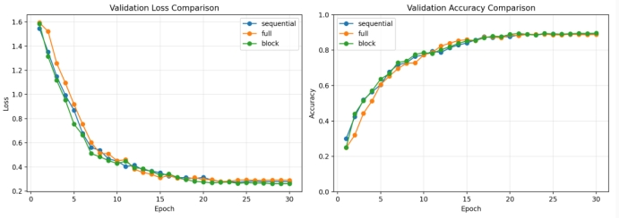

后续我还在改，然后准备将要PRI和TDOA这两个时序注入后面的时序处理中。
